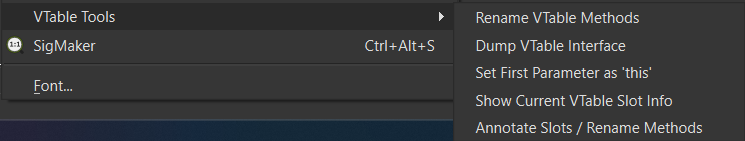
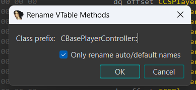
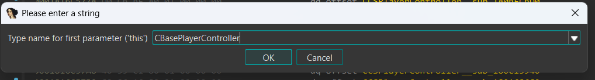
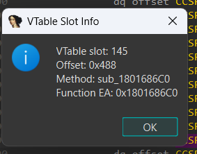

# VTable Context Tools

**VTable Context Tools** is an **IDA Pro 9.X** plugin that adds right-click actions for probable vtable entries in disassembly and pseudocode views.

## Features



### Dump a C++ interface skeleton (`.hpp`) from detected vtable slots.

```cpp
class CBasePlayerController
{
public:
    virtual ~CBasePlayerController() = default;

    virtual void nullsub_1011(); // 0 0x0
    virtual void nullsub_1874(); // 1 0x8
    virtual void sub_180A71030(); // 2 0x10
    virtual void sub_180A5A550(); // 3 0x18
    virtual void sub_180A63920(); // 4 0x20
    virtual void sub_180A65D50(); // 5 0x28
    virtual void sub_1803BDDE0(); // 6 0x30
...
```

### Annotate vtable slots or rename target methods with slot metadata.

The context menu action supports two modes:

Mode A adds a regular comment to each vtable slot so you can see lines like:

```cpp
dq offset CEngineClient__sub_18007C450 ; 61 0x1E8
```

Mode B renames each unique target function by appending the slot index and relative offset, for example:

```cpp
CEngineClient__sub_18007C450_61_1E8
```

### Rename vtable target methods with a class prefix.



### Set the first parameter as typed `this` (pointer) for vtable methods.



### Show current slot index and relative offset for the selected vtable entry.



